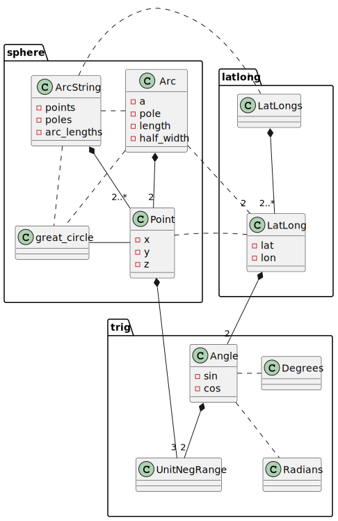
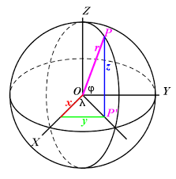
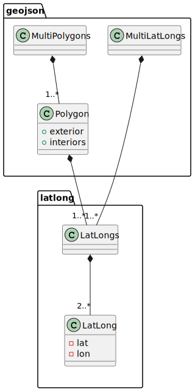

# via-sphere

A library for performing geometric calculations on the surface of a sphere.

## Description

This library uses a combination of spherical trigonometry and vectors
to calculate angles, distances and positions on the surface of a unit sphere.

  
*Figure 1 Class Diagram*

The `trig` and `latlong` modules perform spherical trigonometric calculations;  
the `sphere` module uses vectors.

### Spherical trigonometry

[Spherical trigonometry](https://en.wikipedia.org/wiki/Spherical_trigonometry)
is the branch of spherical geometry involving spherical triangles.
A spherical triangle is a triangle on the surface of a sphere.
The sides of spherical triangles are [great circles](https://en.wikipedia.org/wiki/Great_circle) i.e., the shortest path between two points on the surface of a sphere - the equivalent of straight line segments in planar geometry.

Spherical trigonometry is particularly useful for calculating great circle arcs
between two points from their latitudes and longitudes.

### Vectors

Tracking progress along a great circle e.g.: measuring across track distance
from a great circle or distance along a great circle arc is more simply and
efficiently calculated using vectors instead of spherical trigonometry.

Vectors can also be used to perform measurements on the surface of a sphere,
by using 3D vectors with x, y and z coordinates to represent points, see *Figure 2*.

  
*Figure 2 Spherical Vector Coordinates*

A key feature of vectors is that a great circle can be represented by q 3D vector
perpendicular to the plane of the great circle i.e. its `pole`.
For example, the equator may be represented the (true) North pole or South pole.

Using vectors enables the across track distance of a point from a great circle
to be calculated using little more than a vector [dot product](https://en.wikipedia.org/wiki/Dot_product). Similarly, other calculations such as along track distance
and great circle arc intersections are simple to calculate with vectors.

## Design

The library uses the [newtype](https://rust-unofficial.github.io/patterns/patterns/behavioural/newtype.html) idiom to represent angles in `Degrees` and `Radians`.
It also uses the `newtype` idiom to represent `UnitNegRange`s; values that lie between -1.0 and +1.0 inclusive.

The `Angle` struct represents an angle by its sine and cosine components as
`UnitNegRange`s.
The `LatLong` struct represents a coordinate on the unit sphere by
its latitude and longitude as a pair of `Angle` structs.  
This representation simplifies the conversion of `LatLong`s to `Point` vectors and
spherical trigonometry calculations.

The `geojson` module defines types derived from `LatLong` for
[GeoJSON](https://geojson.org/) serialization/deserialization using the
[geo-types](https://crates.io/crates/geo-types) crate, see *Figure 3*.

  
*Figure 3 LatLong Class Diagram*

Note: [Antimeridian Cutting](https://datatracker.ietf.org/doc/html/rfc7946#section-3.1.9) is **not** required, since this library **can** handle
features that cross the antimeridian.

The library uses the [contracts](https://crates.io/crates/contracts) crate
to implement Design By Contract [(DbC)](https://wiki.c2.com/?DesignByContract).  
It also defines a `Validate` trait to define an `is_valid` invariant
function to support Design By Contract invariants.

## Contribution

If you want to contribute through code or documentation, the [Contributing](CONTRIBUTING.md) guide is the best place to start. If you have any questions, please feel free to ask.
Just please abide by our [Code of Conduct](CODE_OF_CONDUCT.md).

## License

`via-sphere` is provided under a MIT license, see [LICENSE](LICENSE).

Contact <sphere@via-technology.aero> for more information.
