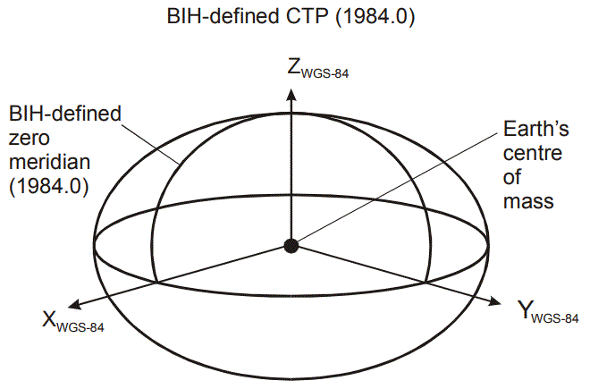

# Global Navigation

## Shape of the Earth

Most people consider the Earth to be a sphere and while a sphere is a good
approximation of the shape of the Earth, the Earth is more like a slightly
squashed sphere: flattened at the poles and bulging at the Equator.  The
most precise models of the Earth consider it to be slightly pear shaped,
see [Figure of the Earth](https://en.wikipedia.org/wiki/Figure_of_the_Earth).

The most significant model of the Earth’s shape is an oblate ellipsoid,
i.e. the ellipsoid of revolution obtained by rotating an ellipse about its
shorter axis. 
This is the shape of the WGS-84 Earth reference model used by Global
Positioning System (GPS) satellites, ground stations and receivers,
see Figure 1.

  
*Figure 1 The WGS-84 ECEF Coordinate System*

WGS-84 defines the flattening of the Earth ellipsoid at the poles as
1 / 298.257223563.  
I.e. the WGS-84 Earth ellipsoid is sphere squashed by approximately 1/3%.

## Map Projection

Regardless of the shape of the Earth, navigation has traditionally been
performed using planar maps. 

Maps are created by transforming locations on the (curved) surface of the
Earth onto a flat surface using a map projection.  
All map projections distort the Earth’s surface in one way or another.
However, different types of map projections can preserve some properties
at the detriment of others, see [List of map projections]( https://en.wikipedia.org/wiki/List_of_map_projections#Type_of_projection )
and [Tissot’s indicatrix]( https://en.wikipedia.org/wiki/Tissot%27s_indicatrix). 

All projection distortions are relatively small close to the centre of the
projection, but some distortions increase substantially further from the
centre of the projection.

## Shortest Distance

A common task in navigation is to calculate the shortest distance between a
pair of positions.

On a flat surface the shortest distance between positions is along the
straight line between them. On a sphere (or an ellipsoid), the shortest
distance between positions is along the Great Circle (or geodesic) between
them.

The shortest Great Circle or geodesic distance between positions can measured
simply on the surface of a globe, from the length of a piece of string held
tight to the surface of the globe between the positions. However, when plotted
on a map or chart, a Great Circle or a geodesic between two positions often
appears as a curved line, revealing the map projection distortion.

Navigators could have used globes to eliminate map projection distortion, but
globes are big and bulky while paper maps and charts are more compact and
practical. Nowadays many paper maps and charts have been replaced with
electronic equivalents. However, only the medium has changed, most electronic
maps and charts still project the Earth onto a planar surface using a map
projection together with its associated distortion.

## Spherical Trigonometry

The Great Circle paths between positions on a sphere can be calculated more
accurately using spherical trigonometry instead of with globes and bits of
string, see [Great Circle Navigation](https://en.wikipedia.org/wiki/Great-circle_navigation).
For example, the [Haversine Formula]( https://en.wikipedia.org/wiki/Haversine_formula)
is often used to calculate Great Circle distances from the latitudes and
longitudes of positions.

## Ellipsoidal Geometry

The shortest distance between positions on an ellipsoid is along the geodesic
between them,
see [Geodesics on an ellipsoid](https://en.wikipedia.org/wiki/Geodesics_on_an_ellipsoid).

The difference between a sphere and the WGS-84 ellipsoid is only about 1/3%
and in most cases the distance saved by following a geodesic path instead of
a Great Circle path is very small. It is significantly more complicated to
calculate a geodesic path instead of a Great Circle path and in most cases
the extra complication is hard to justify.

However, the flattening at the poles causes East to West (or vice versa)
geodesic paths to be closer to the poles than their equivalent Great Circle
paths. This effect is at its most extreme between antipodal points on the
Equator, where the Great Circle path goes around the Equator, while the
geodesic path goes through the North or South pole!

## Global Geometry

Electronic maps and charts normally use a map projection to transform WGS84
latitudes and longitudes into two-dimensional (2D) Cartesian coordinates
which are stored in memory.

The GPS system uses the positions of GPS monitoring stations in earth-centred,
earth-fixed (ECEF) three-dimensional (3D) Cartesian coordinates as reference
positions, see Figure 1.

3D ECEF coordinates are not as “compact” as 2D Cartesian coordinates since they
require one and half times the amount of memory to store the extra coordinate.
However, they enable modern electronic navigation systems to eliminate the
inherent map projection errors of 2D Cartesian coordinate systems.
