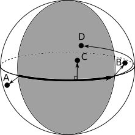

# Spherical Vector Geometry

## Spherical Geometry

There are many similarities between spherical geometry and planar
(Cartesian) geometry.  
Over small distances, equivalent spherical and
planar equations produce the same results, to a reasonable degree of
accuracy.

The key difference between planar and spherical geometry is that in
spherical geometry all distances are measured as angles (from the centre
of the sphere).

To convert a spherical geometry distance to a conventional distance,
it is necessary to multiply the spherical distance (i.e. the angle in radians)
by the radius of the sphere.

## Vector Geometry

A vector is geometric object with a length and direction.

Computer systems usually store vectors in [Cartesian coordinates](https://en.wikipedia.org/wiki/Cartesian_coordinate_system):
2D vectors are stored in 2 (x and y) coordinates,
while 3D vectors require 3 (x, y and z) coordinates, see Figure 1.

  
*Figure 1 Spherical Vector Coordinates*

### Length and direction

The length of a 2D vector is: √(x² + y²) while the length of a 3D vector is: √(x² + y² + z²)

The direction of a vector is normally denoted by a unit vector, i.e. a
vector with a length of one.

The unit vector of an arbitrary vector can be found by *normalizing* the vector,
i.e. dividing the vector by its length.  
Note: zero length vectors cannot be normalized, since normalizing would involve
a division by zero.

### Addition, subtraction, multiplication and division

The addition of two vectors is the pairwise addition of their components.
Similarly, the subtraction of two vectors is the pairwise subtraction of
their components.

Vectors can be scaled by multiplying (or dividing) them by a constant,
where each component is scaled by the constant.

### Dot Product

The [dot product](https://en.wikipedia.org/wiki/Dot_product) (aka scalar
product, or inner product) of two vectors is the scalar sum of the product of
their corresponding coordinates.  
  
It is commutative, associative and equal to the product of the two vector
lengths multiplied by the cosine of the angle between them, i.e.:
  
  **u.v** = **v.u** = **|u||v|**cos θ
  
The dot product of a vector with itself is its *norm*, i.e. the square
of its length.

### Cross Product

The [cross product](https://en.wikipedia.org/wiki/Cross_product) (aka vector
product or outer product) of two 3D vectors is a new vector perpendicular to
the plane containing the 3D vectors.  

It is not commutative or associative and its length is given by the product
of the two vector lengths multiplied by the sine of the angle between them, i.e.:

**w** = **u**X**v** = -(**v**X**u**) = **n** **|u||v|** sin θ

where **n** is the unit vector of the cross product's direction.

### Spherical Points

A point on a sphere of radius r can be modelled by a 3D vector with (x, y, z)
coordinates where:

r = √(x² + y² + z²)

Normalized vectors lie on the unit sphere, where r = 1.

Using normalized vectors to represent points on a sphere enables sines and
cosines of angles to simply be calculated from vector dot and cross product
functions, i.e.:

**u.v** = **v.u** = cos θ

and

**u**X**v** = -(**v**X**u**) = **n** sin θ

## Spherical Vector Geometry

### Point to Point Distance

The Great Circle distance between two points is the angle between them from
the centre of the sphere. It could simply be calculated as the arccos
of their dot product.

However, it is recommended that the arccos of the dot product is not used since
the arccos function can be inaccurate where points are close to each other.
The arctan version (taking both dot and cross products) is preferred,
see: [n-vector Surface distance](http://www.navlab.net/nvector/#example_5):

σ = atan2(length(**u**X**v**), **u.v**)

### Great Circle Pole

The Great Circle between two points is defined by its pole.  
The pole of a Great Circle is a unit vector normal to the plane of the
Great Circle, i.e. normal to the position vectors of the points.

The pole of a Great Circle is calculated by normalizing the cross product of
a pair of position vectors.

### Great Circle Arc

Just as the shortest distance between two points on a Cartesian plane is along
a straight line, the shortest distance between two points on the surface of a
sphere is along the arc of a Great Circle.

The arc of a Great Circle can be defined by:

* the start point,
* the pole of the Great Circle
* and the length of the arc.

### Cross Track Distance

The distance of a point either side of a Great Circle can be calculated from
the dot product of the point and the pole of the Great Circle, reading the
distance as a sine instead of a cosine, see [n-vector Cross track distance](http://www.navlab.net/nvector/#example_10):

sin xtd = **c.p**

Note: the across track distance is positive to the left of the Great Circle
and negative to the right of it.

### Along Track Distance

The distance of a point along an arc can be calculated from the distance of
the point from the start of the arc and its across track distance using the
spherical equivalent of Pythagoras's equation, i.e.:

cos c = cos a cos b

where: a and b are the lengths of the side by the right angle and c is the
hypotenuse, see Figure 2.

  
*Figure 2 Spherical Right Angled Triangle*

Therefore:

atd = arccos(cos (distance) / cos xtd)

Whether the distance is positive or negative (i.e. ahead or behind the start
point) can be determined by the dot product of the point with the arc's
direction vector.

### Direction Vector

The direction vector of an Arc (**d**) is given by the cross product of its
pole (**c**) and start point (**a**):

**d** = **c** X **a**

### Closest Distance

The closest distance of a point from an arc depends upon where the point lies
relative to the arc: where the point is alongside the arc it is the
cross track distance. Otherwise, the point is closest to one of the ends of
the arc, see Figure 3.

  
*Figure 3 Arc Point Voronoi Diagram*

### Position Along Arc

The location of a point at a given distance along an arc can be calculated
from the along track distance of the point from the start of the arc and the
direction vector of the arc:

**p** = cos (atd) **a** + sin (atd) **d**

### Perpendicular Position

The location of a point at a given distance perpendicular to an arc can be
calculated from the across track distance of the point from a point on the
arc and the pole of the arc:

**p** = cos (xtd) **point** + sin (xtd) **pole**

### Azimuth

The azimuth (angle relative to True North) of a point along an arc can be
calculated from the point and the pole of the arc.

See `calculate_azimuth` in [Arc3d.hpp](../include/via/sphere/Arc3d.hpp).

### Start Angle

The start angle from the start of an arc to a point can be calculated from the
dot product between the pole of the arc and the pole between the start of the
arc and the point.

The sign of the turn angle depends upon the sign of the across track distance
of the point relative to the arc.

### Turn Angle

The turn angle from the end of an arc to a point can be calculated from the
dot product between the pole of the arc and the pole between the end of the
arc and the point.

The sign of the turn angle depends upon the sign of the across track distance
of the point relative to the arc.

### Intersection Point

A pair of Great Circles intersect at two points (unless they are the same
Great Circle or in opposing directions). One of the intersection points can
be found from the cross product of the Great Circle poles, see
[n-vector Intersection of Great Circles](http://www.navlab.net/nvector/#example_9).

### Bisector

For a pair of Great Circles, the Great Circle bisecting them can be found by
adding their poles and then normalizing the resulting vector.
